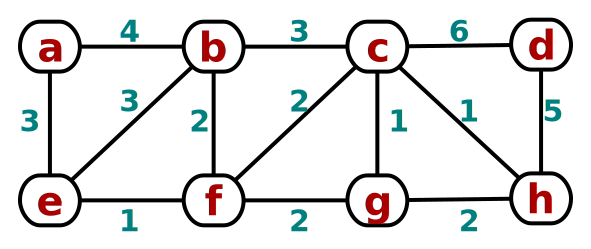
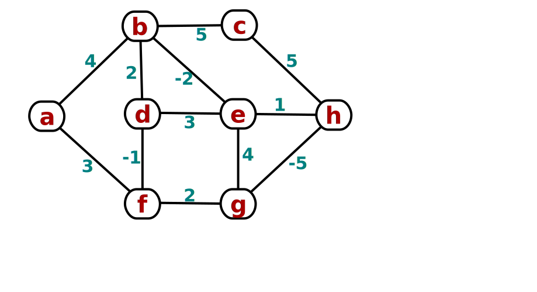





### HW9 (40pts)
1. Consider the following **weighted undirected** graph: <br/> 
   <br/>
  Where there is a choice, consider vertices in **alphabetical** order,
  and edges in **lexicographic** order of endpoints:
    e.g., *(a,c)* < *(a, d)* < *(b, d)*.
  + (a) *(4 pts)* Demonstrate **Kruskal's**
    minimum spanning tree algorithm on the graph.
  + (b) *(4 pts)* Demonstrate **Prim's** algorithm on the graph,
    starting at vertex `a`.
1. *(4 pts)* Demonstrate the **Bellman-Ford** algorithm
  on the weighted directed graph below
  for shortest-paths from the source `a`.
  (Iterate over edges in lexicographic order.)<br/>
  
1. Given a weighted undirected graph \`G = (V, E, w)\`
  with \`w(u,v) > 0, forall (u,v) in E\`,
  consider **increasing** each edge weight by 1: <br/>
  Let \`w'(u,v) = w(u,v) + 1, forall (u,v) in E\`,
  and \`G' = (V, E, w')\`.
  + (a) *(3 pts)* **Prove** or disprove via counterexample:
  **MST**s are preserved by this transformation.
  I.e., if *T* is an MST of *G*, then *T* is also an MST of *G'*.
  + (b) *(3 pts)* **Prove** or disprove via counterexample:
  **shortest paths** are preserved by this transformation.
  I.e., if *p* is a shortest path from *u* to *v* in *G*,
  then *p* is also a shortest path from *u* to *v* in *G'*.
1. **Programming project:** Implement **Prim's algorithm** for minimum spanning tree.
  **Input** format is discussed below.
  Allow the user to specify a **start** node.
  Output is the **weight** of the MST, and for each non-root node, its **parent** in the MST. <br/>
  You may use a library for **priority queue**
  (e.g., [Python's `heapq`](https://docs.python.org/3.0/library/heapq.html));
  you don't have to implement that yourself.
  + *(12 pts)* Correct, working **code**.
  + *(5 pts)* **Documentation**: write-up, readable code, good identifiers, etc.
  + *(5 pts)* **Tests**, including edge cases, actual output, etc.
  + *(4 pts extra credit)* A nice **graphical user interface**.

**Input format** for the programming project: a weighted **edge list** in plain text:

```
[num vertices]
[num edges]
[source] [dest] [weight]
[source] [dest] [weight]
...
```

Some test input
(from [Sedgwick + Wayne](http://algs4.cs.princeton.edu/43mst/)):

+ [tinyEWG.txt](http://algs4.cs.princeton.edu/43mst/tinyEWG.txt) (8 vertices, 16 edges)
+ [mediumEWG.txt](http://algs4.cs.princeton.edu/43mst/mediumEWG.txt) (250 vertices, 1,273 edges)
+ [1000EWG.txt](http://algs4.cs.princeton.edu/43mst/1000EWG.txt) (1,000 vertices, 8,433 edges)
+ [10000EWG.txt](http://algs4.cs.princeton.edu/43mst/10000EWG.txt) (10,000 vertices, 61,731 edges)
+ [largeEWG.txt](http://algs4.cs.princeton.edu/43mst/largeEWG.txt) (one million vertices, 7,586,063 edges)
