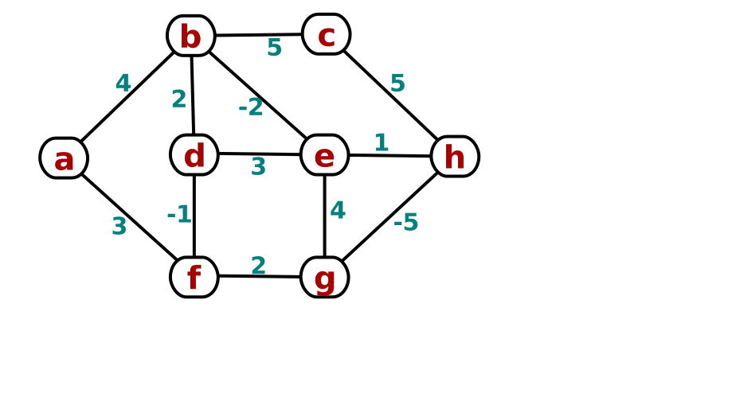

### HW9 Solutions (40pts)
+ (1a) *(3 pts)* **Kruskal** on the following graph:   
  

  

  In order, the edges selected are:
  `(c,g), (c,h), (e,f), (b,f), (c,f), (a,e), (d,h)`.
  The total weight is 3(1) + 2(2) + 1(3) + 1(5) = **15**.

+ (1b) *(4 pts)* **Prim** starting at vertex `a`.
    Illustrate the progress of the vertex **queue**.
    
  Vertex queue:
  + `a:0`
  + `b:4, e:3`
  + `b:3, f:1`
  + `b:2, c:2, g:2`
  + `c:2, g:2`
  + `d:6, g:1, h:1`
  + `d:6, h:1`
  + `d:5`

  The resulting MST is the same.

+ (1c) *(1 pt)* Find a **different** MST

  

+ (2) *(5 pts)* **Bellman-Ford** from source `a`:
  + How many **iterations** were needed to achieve convergence? 
  + 
  + Pass 1: `a:0, b:4, c:9, d:2, e:9, f:3, g:inf, h:10`
  + Pass 2: `a:0, b:3, c:9, d:2, e:5, f:3, g:inf, h:6`
  + Pass 3: `a:0, b:3, c:8, d:2, e:5, f:3, g:inf, h:6`
  + 

+ (3a) *(3 pts)* **Prove** **MST**s are preserved by this transformation.

  **TRUE**:
  A quick answer is that Kruskal's algorithm, for example, only relies on 
  **comparing** edge weights, not the actual value of the weights or any
  arithmetic done on them.  (The weights could in fact be any *ordinal* values,
  e.g., A, B, C, D, ....)  So any transformation that preserves the relative
  sort order of the weights will preserve the MST produced by Kruskal.

  For a more rigorous proof, let \`(u,v) in T\` be an **edge** in an MST of
  the original graph \`G=(V,E,w)\`.
  Let \`T'\` be an MST of the **transformed** graph \`G'=(V,E,w')\`.

  Removing \`(u,v)\` from \`T\` partitions the vertices into two sets
  (i.e., a **cut**), call them \`S\` and \`V-S\`.

  \`T'\` must **cross** the cut somehow; let \`(x,y) in T'\` be
  an edge in \`T'\`that crosses the cut.

  Since \`T\` is an MST of the original graph, so \`(u,v)\` must be a
  **light edge** crossing the cut, under the original weighting.
  Hence \`w(u,v) <= w(x,y)\`.

  But that means that in the **transformed** weights,
  \`w'(u,v) = w(u,v) + 1 <= w(x,y) + 1 = w'(x,y)\`.
  So \`(u,v)\` is also a **light edge** under the transformed weighting.

  So if \`(u,v) !in T',\` we can **replace** \`(x,y) in T'\` with it,
  and the resulting tree will still be minimal-weight.

  This applies for **all** edges \`(u,v) in T\`, hence \`T\` is
  still an MST of the transformed graph.

+ (3b) *(3 pts)* **Prove** or disprove via counterexample:
  **shortest paths** are preserved by this transformation.
  I.e., if *p* is a shortest path from *u* to *v* in *G*,
  then *p* is also a shortest path from *u* to *v* in *G'*.

  **FALSE**: In the counterexample below, originally the shortest
  path from `a` to `d` is via `b` and `c`.  After adding 1 to
  each edge weight, each path increases in weight proportionally to
  its number of edges, so the direct path from `a` to `d`
  becomes the shortest one.

  

+ (4) **Programming project:** Implement **Prim**
  + *(12 pts)* Correct, working **code**.
  + *(5 pts)* **Documentation**: write-up, readable code, good identifiers, etc.
  + *(5 pts)* **Tests**, including edge cases, actual output, etc.
  + *(4 pts extra credit)* A nice **graphical user interface**.
